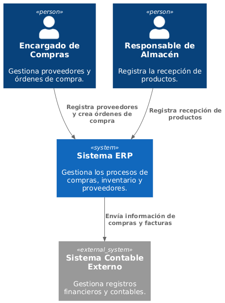

# 3. Alcance y Contexto del Sistema

El Sistema ERP interactúa con los usuarios responsables del proceso de compras y con sistemas externos relacionados con la gestión financiera de la organización.

El Administrador de Compras utiliza el sistema para registrar productos, proveedores y órdenes de compra. Posteriormente, la información puede ser enviada a un sistema contable externo para realizar los procesos financieros correspondientes.

## Actores Principales

- Administrador de Compras.
- Sistema ERP.
- Sistema Contable Externo.

## Diagrama de Contexto

El diagrama representa la interacción entre el usuario encargado del módulo de Compras, el Sistema ERP y un sistema contable externo encargado del procesamiento financiero de la organización.
