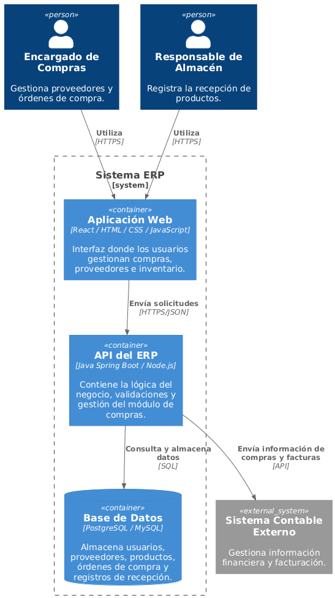

# 5. Vista de Bloques de Construcción

La arquitectura del Sistema ERP está conformada por tres contenedores principales que trabajan de manera integrada para ofrecer los servicios del módulo de Compras.

## Frontend

Aplicación web desarrollada en React que proporciona la interfaz gráfica utilizada por los usuarios para interactuar con el sistema.

## Backend

API desarrollada con Spring Boot encargada de implementar la lógica de negocio, validar la información recibida y gestionar la comunicación con la base de datos.

## Base de Datos

Servidor PostgreSQL encargado de almacenar toda la información relacionada con productos, proveedores, órdenes de compra y demás módulos del ERP.

## Diagrama de Contenedores

El diagrama muestra la interacción entre el usuario, la aplicación web, la API y la base de datos que conforman la arquitectura del sistema.
